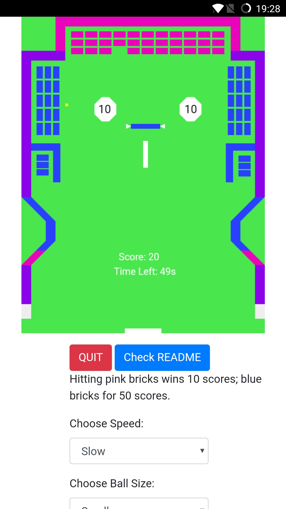

# Gee Bee Game

Mingyu MA/Derek :: [derek.ma](http://derek.ma) :: derek.ma@connect.polyu.hk

**Try the Web version here:**
https://derekmma.github.io/gee-bee-game/

**Download the Android version here:**
https://github.com/derekmma/gee-bee-game/blob/master/GeeBeeGame.apk

## Version

### Android App

Install the `.apk` file under this repo on the Android phone. (Generated by [Adobe PhoneGap](https://phonegap.com))

### Web App

Click `index.html` to play!

## Special Designs

### Eye-friendly UI

On the canvas, some eye-friendly colors are utilized to comfort the eyes. The green background color is good for eye, and the contrast between colors of bricks, balls and other elements and the background is very strong. User can play the game for a longer time if the color is easy for eyes.

### Low-speed Mode

For normal Gee Bee Game, the speed of the ball is normally so fast, so that the elder is hard to handle. In this design, the `Slow` mode keep the ball running at a very low speed, so that the old people is very easy to react to the game.

## Demo Video

https://www.youtube.com/watch?v=qp-PWIqcbRo

